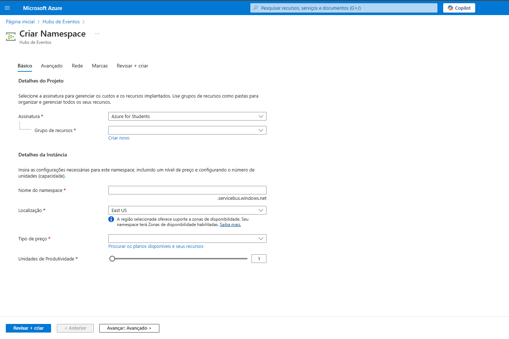
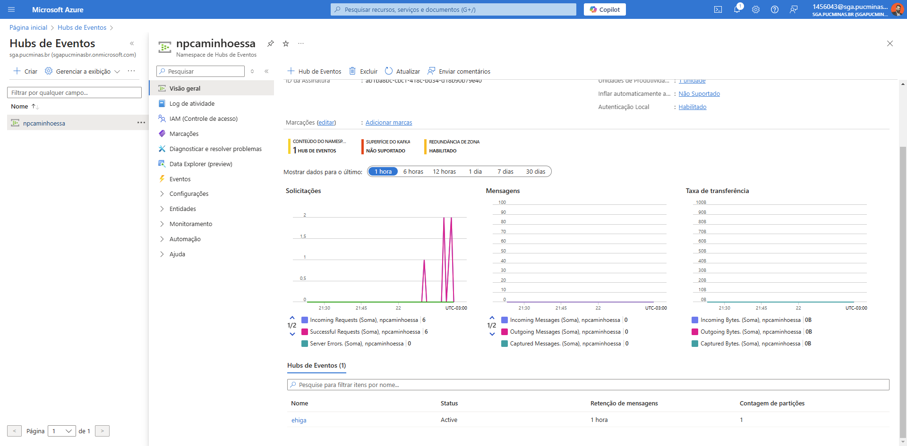

# Guia de Criação de um Event Hubs no Azure

Este guia passo a passo detalha como criar e configurar um Event Hubs no Azure para captura e processamento de eventos.

---

## 1. Acessando o Portal do Azure

1. No portal do Azure, pesquise por **Hubs de Eventos** na barra de pesquisa superior.
2. Clique na opção **Hubs de Eventos** para abrir o painel.


---

## 2. Criando um Namespace

1. No painel de **Hubs de Eventos**, clique em **Criar**.
2. Preencha os campos:
   - **Assinatura**: Escolha sua assinatura (ex.: Azure for Students).
   - **Grupo de recursos**: Clique em **Criar novo** ou selecione um existente.
   - **Nome do namespace**: Insira um nome exclusivo.
   - **Localização**: Escolha a região adequada (ex.: East US).
   - **Tipo de preço**: Escolha **Basic**.
   - **Unidades de Produtividade**: Configure como **1**.
3. Clique em **Revisar + criar** e, em seguida, em **Criar**.



Após a validação, o namespace será criado com as informações especificadas.


---

## 3. Criando um Hub de Eventos

1. Dentro do namespace criado, selecione a opção **Hubs de Eventos**.
2. Clique em **Criar** e configure:
   - **Nome**: Insira o nome do hub de eventos.
   - **Contagem de Partições**: Configure como **1**.
   - **Política de Limpeza**: Escolha **Excluir**.
   - **Tempo de Retenção (horas)**: Configure como **1**.
3. Clique em **Revisar + criar** e, em seguida, em **Criar**.


Após a validação, o hub de eventos estará ativo.



---

## 4. Configurando Políticas de Acesso Compartilhado

1. No namespace, selecione **Políticas de acesso compartilhado**.
2. Clique em **RootManageSharedAccessKey** para visualizar as configurações de chaves de acesso.
3. Copie as chaves primárias ou secundárias para uso posterior.


---

## 5. Configurando o Namespace no Python

### Criar o arquivo `.env`

Crie um arquivo chamado `.env` na raiz do seu projeto e adicione as variáveis de conexão:

```env
CONNECTION_STR=seu_endpoint
EVENT_HUB_NAME=nome_do_event_hub
```

## 6. Instalando as Dependências
Execute o seguinte comando no terminal para instalar as bibliotecas necessárias:
```bah
pip install azure-eventhub python-dotenv
```

## 7. Código Python para Envio de Mensagens
Utilize o seguinte código Python para enviar mensagens ao Event Hub:

```python
from azure.eventhub import EventHubProducerClient, EventData
from dotenv import load_dotenv
import os

# Carregar as variáveis do arquivo .env
load_dotenv()

# Informações de conexão (obtidas do .env)
CONNECTION_STR = os.getenv('CONNECTION_STR')
EVENT_HUB_NAME = os.getenv('EVENT_HUB_NAME')

def send_event_to_event_hub():
    try:
        # Criar um cliente do Event Hub
        producer = EventHubProducerClient.from_connection_string(
            conn_str=CONNECTION_STR,
            eventhub_name=EVENT_HUB_NAME
        )

        # Criar um lote de eventos
        event_data_batch = producer.create_batch()

        # Adicionar eventos ao lote
        event_data_batch.add(EventData("Mensagem 1 para o Event Hub"))
        event_data_batch.add(EventData("Mensagem 2 para o Event Hub"))
        event_data_batch.add(EventData("Mensagem 3 para o Event Hub"))

        # Enviar o lote para o Event Hub
        producer.send_batch(event_data_batch)

        print("Eventos enviados com sucesso!")
    except Exception as e:
        print(f"Erro ao enviar eventos: {e}")
    finally:
        # Fechar a conexão
        producer.close()

if __name__ == "__main__":
    send_event_to_event_hub()
```
## 8. Validando o Envio e Recebimento de Mensagens
Teste o envio e recebimento de mensagens para validar a configuração do Event Hubs.


## Conclusão
Você configurou com sucesso um Event Hubs no Azure. Agora é possível utilizá-lo para capturar e processar eventos em sua solução de engenharia de dados.
