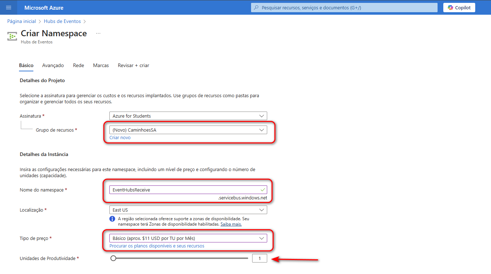

# Guia de Criação de um Datalake

Este guia passo a passo detalha como criar e configurar um Datalake no Azure para armazenar os dados do EventHubReceive. Vamos criar as camadas Bronze, Silver e Gold para a estruturação dos dados.

---

## Passo 1: Acessar o Azure Portal

1. Navegue até o [Azure Portal](https://portal.azure.com/).
2. No menu principal, clique em **Hubs de Eventos** na seção **Serviços do Azure**.
   
   

---

## Passo 2: Criar um Novo Hub de Eventos

1. Clique em **Criar** na tela inicial dos Hubs de Eventos.
   
   
---

## Passo 3: Configurar o Namespace

1. Na tela "Criar Namespace":
   - Selecione a **Assinatura** desejada (ex.: Azure for Students).
   - Escolha **Criar novo** no campo **Grupo de recursos**.

   
   

---

## Passo 4: Definir os Detalhes da Instância

1. Configure os seguintes campos:
   - Nome do namespace: **EventHubReceive**.
   - Localização: **East US**.
   - Tipo de preço: **Básico**.
   - Unidades de produtividade: **1**.

   

---

## Passo 5: Revisão e Criação

1. Revise todas as configurações e clique em **Criar**. Certifique-se de que os detalhes estão corretos.

   

---
## Passo 6. Criando um Hub de Eventos

1. Dentro do namespace criado, selecione a opção **Hubs de Eventos**.
2. Clique em **Criar** e configure:
   - **Nome**: Insira o nome do hub de eventos.
   - **Contagem de Partições**: Configure como **1**.
   - **Política de Limpeza**: Escolha **Excluir**.
   - **Tempo de Retenção (horas)**: Configure como **1**.
3. Clique em **Revisar + criar** e, em seguida, em **Criar**.

   

4. Após a validação, o hub de eventos estará ativo.

   

---
## Passo 7: Criar uma Conta de Armazenamento

1. Pesquise por **Conta de armazenamento** na barra de busca e clique na opção correspondente.

   

2. Clique em **Criar**.

   

3. Configure os detalhes do projeto e da instância:
   - Nome da conta: **caeventhubsreceive**.
   - Localização: **East US**.
   - Desempenho: **Standard**.
   - Redundância: **GRS**.

   
---

## Passo 8: Habilitar Namespace Hierárquico

1. Na aba **Avançado**, habilite o **Namespace hierárquico**.

   

---

## Passo 9: Revisão Final e Criação da Conta de Armazenamento

1. Revise todas as configurações e clique em **Criar**.

   

2. Confirme que a implantação foi concluída com sucesso.

   

---

## Passo 10: Criar Contêiner para Dados Bronze

1. Navegue até a conta de armazenamento criada.
2. Clique em **Contêiner** e depois em **+ Contêiner**.
3. Nomeie o contêiner como **bronze** e configure o nível de acesso anônimo conforme desejado.

   
4. Verifique se o contêiner foi criado corretamente.

   

---

## Passo 11: Verificação Final

1. Acesse a visão geral da conta de armazenamento para verificar as configurações gerais e garantir que tudo está configurado corretamente.

   

2. Revise a estrutura dos contêiners e confirme que o contêiner **bronze** está listado.

   
---

## Passo 12: Preencher o arquivo .env com os detalhes da conta de armazenamento

1. Navegue até **Segurança + rede** na conta de armazenamento **caeventhubsreceive**.
2. Selecione **Chaves de acesso** e copie a **Cadeia de conexão** da **key1**.

   

3. Preencha o arquivo `.env` com os seguintes campos:
   ```env
   STORAGE_ACCOUNT_NAME=caeventhubsreceive
   STORAGE_ACCOUNT_KEY=<chave_copiada>
   CONNECTION_STRING=<cadeia_de_conexao_copiada>
   ```

---

## Passo 13: Configurar o Event Hub

1. Navegue até o **Hub de Eventos** criado anteriormente.
2. Confirme o nome do Event Hub: **eventhubreceive**.

   

3. Acesse **Políticas de acesso compartilhado** no namespace e copie a **Cadeia de conexão** da **RootManageSharedAccessKey**.

   

4. Atualize o arquivo `.env` com os seguintes campos:
   ```env
   EVENT_HUB_NAMESPACE=Receive
   EVENT_HUB_CONNECTION_STRING=<cadeia_de_conexao_namespace>
   EVENT_HUB_NAME=eventhubreceive
   ```

---

## Passo 14: Instalando as Dependências
   Execute o seguinte comando no terminal para instalar as bibliotecas necessárias:
```bah
pip install azure-eventhub python-dotenv
```

## Passo 15: Código Python para Envio de Mensagens
   Utilize o seguinte código Python para enviar mensagens ao Event Hub:

```python
from azure.eventhub.aio import EventHubConsumerClient
from azure.eventhub.extensions.checkpointstoreblobaio import BlobCheckpointStore
from azure.storage.blob.aio import ContainerClient
from dotenv import load_dotenv
import os
import asyncio
from datetime import datetime

# Carregar variáveis do .env
load_dotenv()

# Configurações de conexão
EVENT_HUB_CONNECTION_STRING = os.getenv("CONNECTION_STR")
EVENT_HUB_NAME = os.getenv("EVENT_HUB_NAME")
STORAGE_CONNECTION_STRING = os.getenv("STORAGE_CONNECTION_STR")
BLOB_CONTAINER_NAME = os.getenv("BLOB_CONTAINER_NAME")
CONSUMER_GROUP = "$Default"

# Função para salvar eventos no Data Lake Bronze
async def save_to_datalake(event_data, partition_id):
    timestamp = datetime.utcnow().strftime("%Y%m%d%H%M%S%f")
    file_name = f"bronze/partition_{partition_id}/{timestamp}.json"
    container_client = ContainerClient.from_connection_string(STORAGE_CONNECTION_STRING, BLOB_CONTAINER_NAME)
    async with container_client:
        blob_client = container_client.get_blob_client(file_name)
        await blob_client.upload_blob(event_data, overwrite=True)
    print(f"Evento salvo no Data Lake: {file_name}")

# Handler para processar eventos
async def process_event(partition_context, event):
    print(f"Received event: {event.body_as_str()} from partition {partition_context.partition_id}")
    await save_to_datalake(event.body_as_str(), partition_context.partition_id)
    await partition_context.update_checkpoint(event)

# Handler para processar erros
def process_error(partition_context, error):
    if partition_context:
        print(f"Error in partition {partition_context.partition_id}: {error}")
    else:
        print(f"General error: {error}")

# Função principal para consumir eventos
async def consume_events():
    checkpoint_store = BlobCheckpointStore.from_connection_string(
        STORAGE_CONNECTION_STRING, BLOB_CONTAINER_NAME
    )

    consumer_client = EventHubConsumerClient.from_connection_string(
        EVENT_HUB_CONNECTION_STRING,
        consumer_group=CONSUMER_GROUP,
        eventhub_name=EVENT_HUB_NAME,
        checkpoint_store=checkpoint_store,
    )

    try:
        print("Iniciando processamento de eventos...")
        await consumer_client.receive(
            on_event=process_event,
            on_error=process_error,
            starting_position="-1",  # Consome desde o início do Event Hub
        )
    except KeyboardInterrupt:
        print("\nInterrupção detectada. Encerrando...")
    finally:
        await consumer_client.close()

# Execução do script
if __name__ == "__main__":
    asyncio.run(consume_events())

```
## Passo 16: Validando o Envio e Recebimento de Mensagens
Teste o envio e recebimento de mensagens para validar a configuração do Event Hubs e Datalake.


## Conclusão
Você configurou com sucesso um Event Hubs no Azure. Agora é possível utilizá-lo para capturar e processar eventos em sua solução de engenharia de dados.