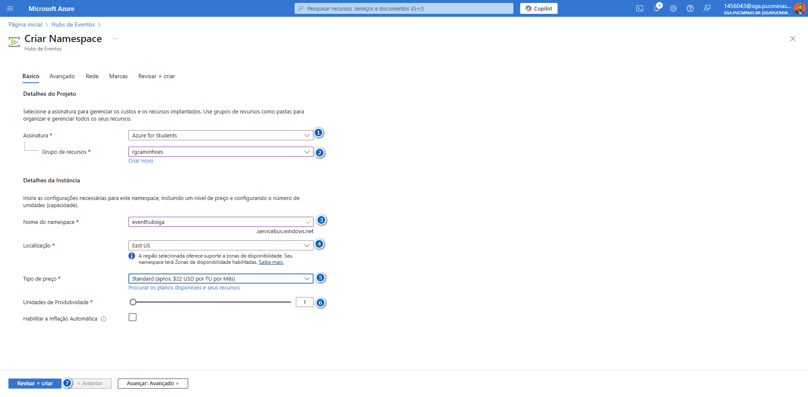

# Guia para Criar um Azure Stream Analytics Job

Este guia descreve como configurar e implementar um trabalho de análise de fluxo no Azure Stream Analytics (ASA).

---

## Passo 1: Navegar para Trabalhos do Stream Analytics

1. No portal do Azure, pesquise por **Stream Analytics** na barra de busca.
2. Clique em **Trabalhos do Stream Analytics**.


---

## Passo 2: Criar um Novo Trabalho do Stream Analytics

1. Clique em **+ Criar**.
2. Preencha os detalhes básicos:
   - **Assinatura**: Selecione a assinatura desejada.
   - **Grupo de recursos**: Escolha ou crie um grupo de recursos.
   - **Nome**: Nomeie o trabalho como `asacaminhoes`.
   - **Região**: Escolha a região apropriada.
   - **Ambiente de Hospedagem**: Selecione **Nuvem**.


---

## Passo 3: Revisar e Criar o Trabalho

1. Revise as configurações inseridas para garantir que estejam corretas.
2. Clique em **Criar** para iniciar a implantação do trabalho.


---

## Passo 4: Confirmar a Implantação

Após a criação, a implantação será concluída com sucesso. Clique em **Ir para o recurso** para acessar o trabalho criado.


---

## Passo 5: Configurar o Trabalho do Stream Analytics

1. No painel do trabalho, configure as entradas, saídas e consultas conforme necessário.
2. Lembre-se de pausar ou ajustar o trabalho quando não estiver em uso para evitar custos adicionais.


---

## Passo 6: Adicionar Entradas ao Trabalho

1. Acesse a seção **Consulta** e clique em **Entrada de fluxo**.
2. Escolha a fonte de dados, como **Armazenamento de blobs/ADLS Gen2**, **Hub de Eventos**, ou outra opção disponível.


3. Continue explorando as opções de entrada, como **Azure Data Explorer**, **Kafka**, entre outras.


---

## Passo 7: Criar uma Conta de Armazenamento

1. No portal do Azure, pesquise por **Storage Account**.
2. Clique em **Contas de Armazenamento**.
3. Clique em **+ Criar** e preencha os detalhes básicos, como grupo de recursos, nome e redundância.


4. Configure as opções avançadas para atender às necessidades específicas do seu trabalho.


---

## Passo 8: Configurações Avançadas para a Conta de Armazenamento

1. Configure as opções avançadas, como **Habilitar namespace hierárquico**.
2. Ajuste as configurações de segurança e redundância, conforme necessário.
3. Clique em **Próximo** e revise as configurações.


4. Finalize a criação da conta de armazenamento verificando as configurações inseridas.


---

## Passo 9: Confirmar a Implantação da Conta de Armazenamento

Após criar a conta de armazenamento, a implantação será concluída com sucesso. Acesse a conta criada para configurar os contêineres.


---

## Passo 10: Criar Contêineres na Conta de Armazenamento

1. Acesse a seção **Contêineres** na conta de armazenamento.
2. Clique em **+ Contêiner** e defina um nome, como `gold`.
3. Certifique-se de ajustar o nível de acesso conforme necessário.


4. Verifique os contêineres criados.


---

## Passo 11: Adicionar Entradas no Stream Analytics

1. Volte para o trabalho do Stream Analytics.
2. Na seção **Entradas**, clique em **+ Adicionar entrada**.
3. Escolha a fonte como **Armazenamento de blobs/ADLS Gen2** e configure as opções:
   - Nome da entrada: `inputDataLakeSA`
   - Conta de armazenamento: `sacaminhoes`
   - Contêiner: `bronze`
   - Formato de serialização: **JSON**


4. Após salvar, verifique as entradas criadas.


---

## Passo 12: Configurar Saídas no Stream Analytics

1. Na seção **Saídas**, clique em **+ Adicionar saída**.
2. Escolha a opção **Armazenamento de blobs/ADLS Gen2** e configure as opções:
   - Nome da saída: `outputDataLakeSA`
   - Conta de armazenamento: `sacaminhoes`
   - Contêiner: `bronze`
   - Formato de serialização: **JSON**


3. Configure a consulta SQL para vincular as entradas e saídas:

```sql
SELECT 
    *
INTO 
    [outputDataLakeSA]
FROM 
    [inputDataLakeSA]
```


---

## Passo 13: Configurar Hubs de Eventos

1. No portal do Azure, pesquise por **Hubs de Eventos** e clique em **Criar Namespace**.
2. Configure os detalhes básicos, como assinatura, grupo de recursos, nome do namespace e região.


3. Revise e crie o namespace.


4. Acesse o namespace criado e clique em **Hubs de Eventos** para adicionar um novo Hub.


5. Configure os detalhes básicos do Hub, como nome, contagem de partições e tempo de retenção.



6. Revise e crie o Hub de Eventos.


---

## Passo 14: Adicionar Entrada do Hub de Eventos ao Stream Analytics

1. Na seção **Entradas** do trabalho do Stream Analytics, clique em **+ Adicionar entrada**.
2. Selecione **Hub de Eventos** e configure os detalhes:
   - Nome da entrada: `inputEHIGA`
   - Namespace: `eventhubsiga`
   - Nome do Hub de Eventos: `ehiga`
   - Grupo de Consumidores: `SDefault`
   - Formato de serialização: **JSON**
   - Codificação: **UTF-8**


3. Salve as configurações e verifique as entradas atualizadas.


---

## Passo 15: Configurar Entrada de Consulta e Teste

1. Adicione um alias à entrada configurada, como `inputEHIGA`.
2. Certifique-se de configurar o namespace, o hub e o grupo de consumidores corretamente.


3. Revise e salve as configurações.


4. Execute a consulta para testar os dados recebidos e processados.


---

## Passo 16: Monitoramento do Stream Analytics

1. Navegue até a aba de **Monitoramento** no trabalho do Stream Analytics.
2. Verifique as métricas de desempenho e logs para garantir que o trabalho esteja funcionando corretamente.


---

## Passo 17: Revisão Final e Execução do Trabalho

1. Certifique-se de que todas as entradas, saídas e consultas estejam configuradas corretamente.
2. Inicie o trabalho clicando em **Iniciar** e monitore os resultados na aba de **Simulação de Trabalho**.


---
